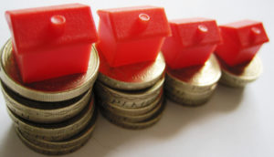

If you need to sell your house fast, this how-to guide for a quick house sale can help.

## What a Quick House Sale Service Can Provide

Trisha Gordon had been trying to sell an inherited property in Northamptonshire for over a year. In desperation, she and her husband, Peter, turned to Sell your house fast, a company that specializes in quick house sales. Using the quick online house price valuation form, they were able to determine that their house was worth anywhere between £80,000 to £100,000. A phone call with a specialist from Sell your house fast helped them to determine whether a quick house sale was right for them.

The couple decided to go along with the sale to Sell your house fast as the hassle of selling their home was taken off their hands. The house was costing them due to council tax bills and insurance so when they were offered £75,000 for a fast home sale, they thought that was a fair price. In order to determine the price that could be offered, the Sell your house fast specialist had to visit their home, take some pictures, and get a bit more information from them.

The whole process was stress-free with no legal fees or other costs to pay. Within a few weeks, they had signed the paperwork, a quick home sale went through, and the cash was transferred to their bank account.

## The Quick House Sale Market

For homeowners keen to sell quickly, a company that offers to buy your house in a matter of weeks at close to its market value can seem like the ideal solution, especially when there are no other alternatives. 20% of the homes in the U.K are sold ‘off-market’, i.e., they are not listed in the traditional house market media for sale. A homeowner may choose to sell their property off-market for several reasons. They may be trying to maintain confidentiality about the sale, whether for family, personal, or business reasons.

Another problem that the traditional housing market has is that the majority of home buyers in this market are buying for residential purposes with the use of a mortgage from a mortgage lender. Some properties will not lend themselves to being purchased with a mortgage due to the higher risk that the mortgage lender is put under for repayment of the loan. Risks for mortgage lenders might include poor house construction, close location to a business with a high risk of fire, water damage, or health hazards, or other environmental factors such as Japanese knotweed growing in the garden. As lenders are also providing a loan for the purpose of the house being occupied, they will typically refuse a mortgage if the house is not deemed ‘livable’. The poor condition of a property could stop it being ‘livable’ especially if it has no bathroom and or kitchen facilities. For the homes that fall under the category of being unmortgageable, an off-market sale might be the only solution to get it off the owner's hands. The quick house sale market, therefore, provides a nice solution for the non-traditional house sellers so that they aren't left in a property sale conundrum.

The quick house sale sector represents around 1% of all UK property sales, with total sales of between £500m and £900m. According to HM Revenue & Customs, there were more than 930,000 residential property sales in the UK last year, which suggests around 9,000 were in the quick house sale sector. The OFT estimates an average quick-sale deal was around £100,000. These statistics show that the quick house sale market is a valuable part of the property market that is solving a genuine need for the participants. Sellers in this market could include older people selling to move closer to family or to fund care. Some need to sell after a relationship breakdown or a divorce; others want to offload an inherited property or clear debts. Buyers in this market are typically investors looking to get a good return for the money they invest, whether institutional or high net worth individuals.

## Other Forms of Off-Market Sale

You should only consider using the services of a Sell your house fast specialist if your need to move is greater than your need to sell your house for the best price. If you are determined on a fairly quick house sale at a good price, selling your property at auction is another alternative. Once the hammer falls the bidder is legally contracted to the sale, with the balance cleared within two months. A minimum price can be set at auction, so you do not have to accept any offer. However, home sellers will have to pay auction fees and legal fees, whether or not the house sells which can no doubt be frustrating if you are short of cash. You can make inquiries at your local property auctioneers and check their terms and conditions.

Here are some tips for potential sellers so that you don’t get caught out when trying to sell your house:

- Don’t accept verbal information or promises
- Don’t commit to a sale until surveys and legal checks have been carried out
- Watch out for long tie-ins
- Check the provider company’s background
